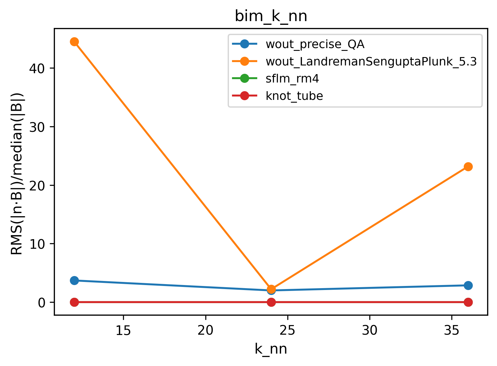
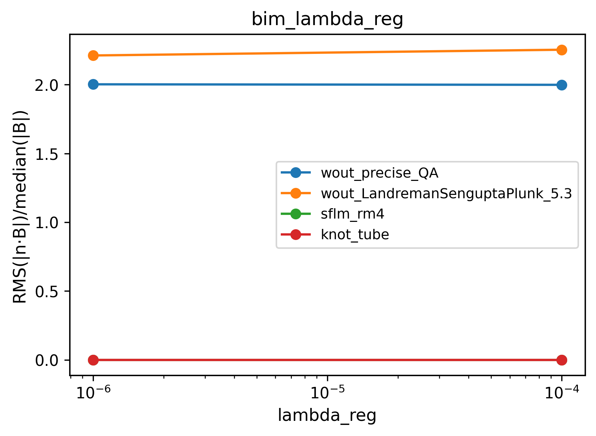
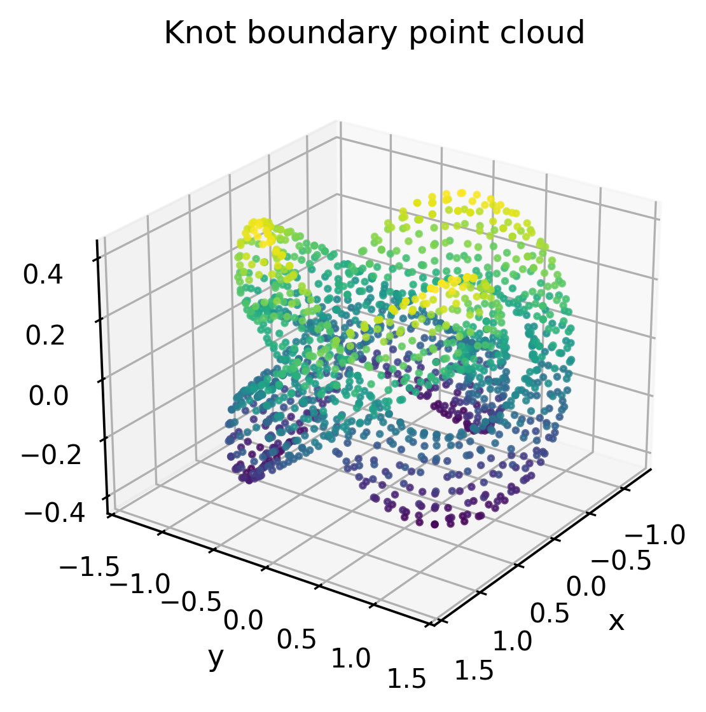
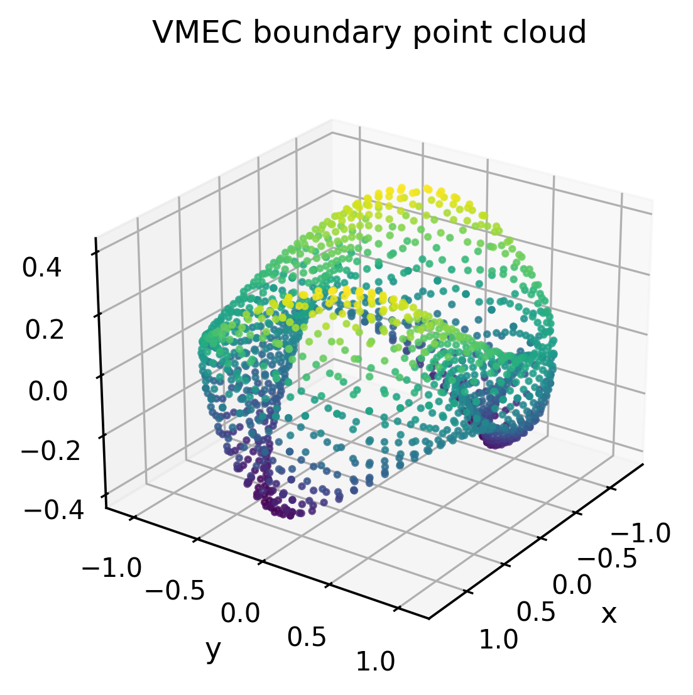
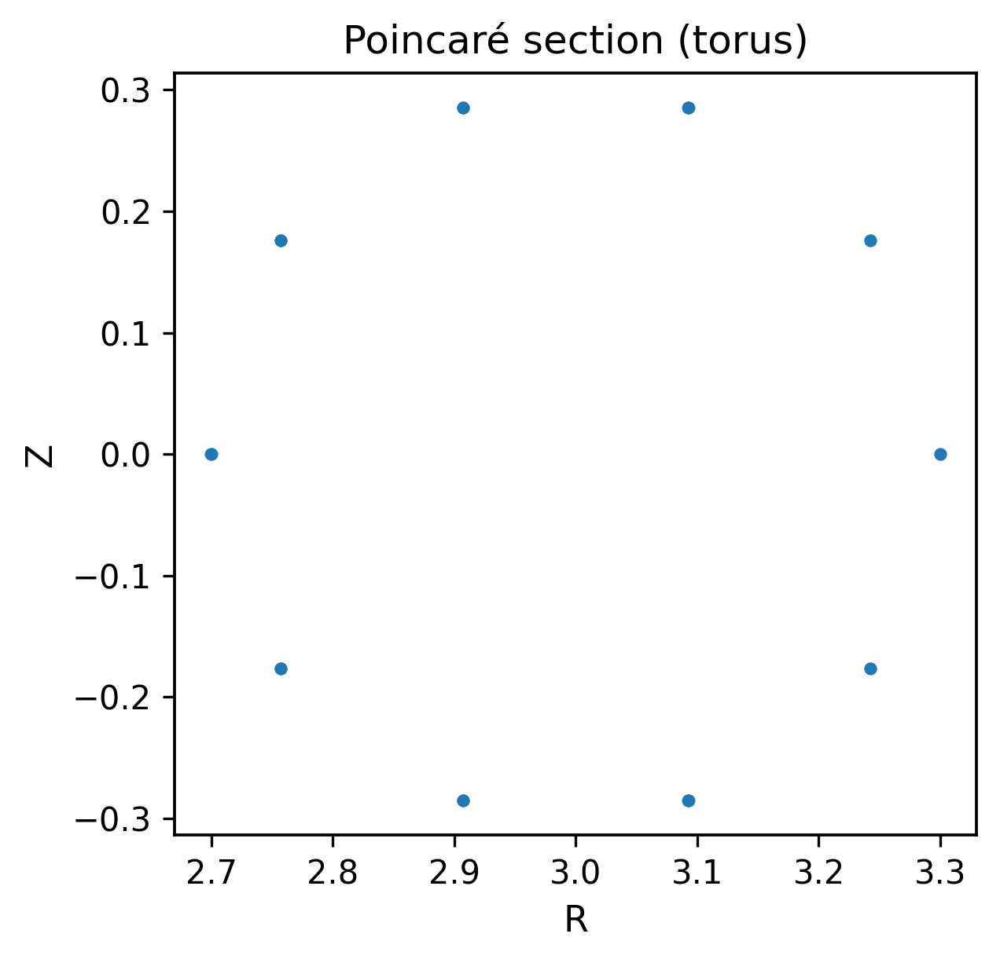
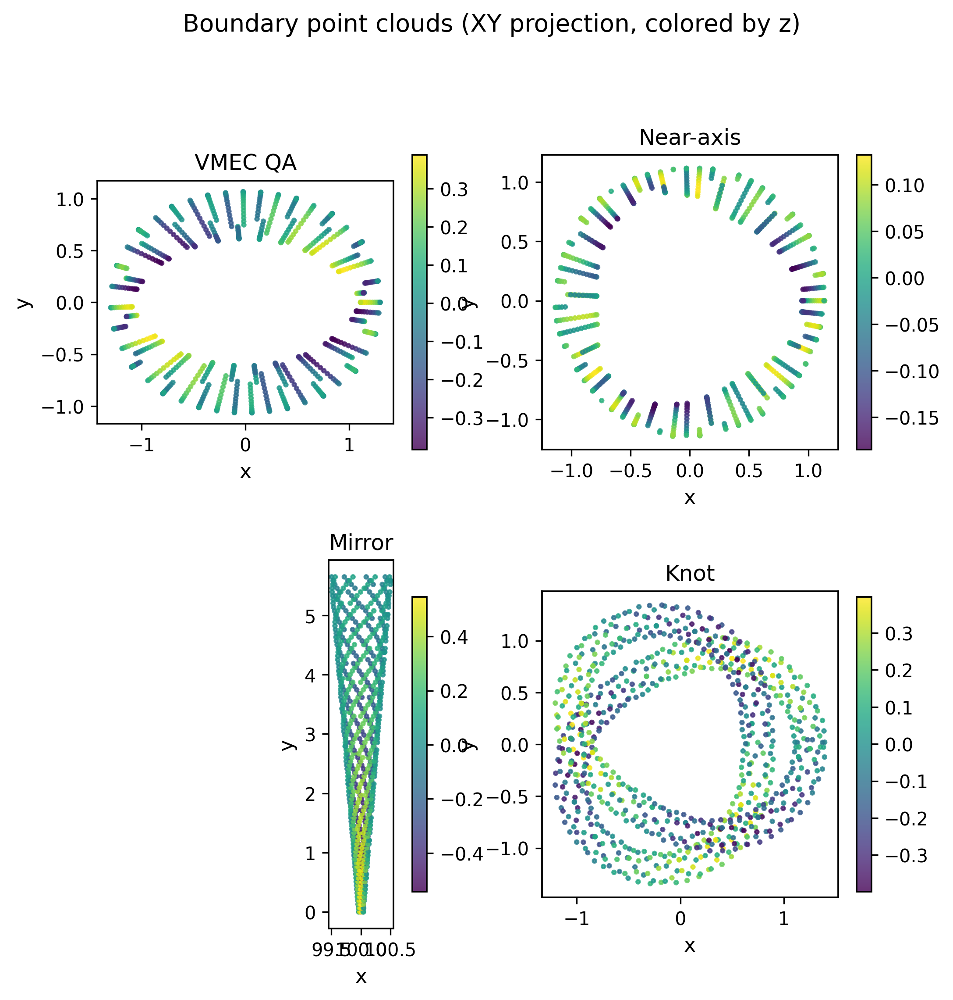
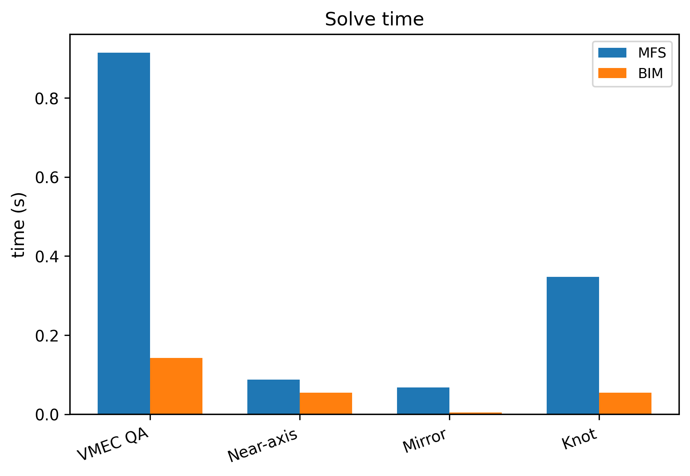
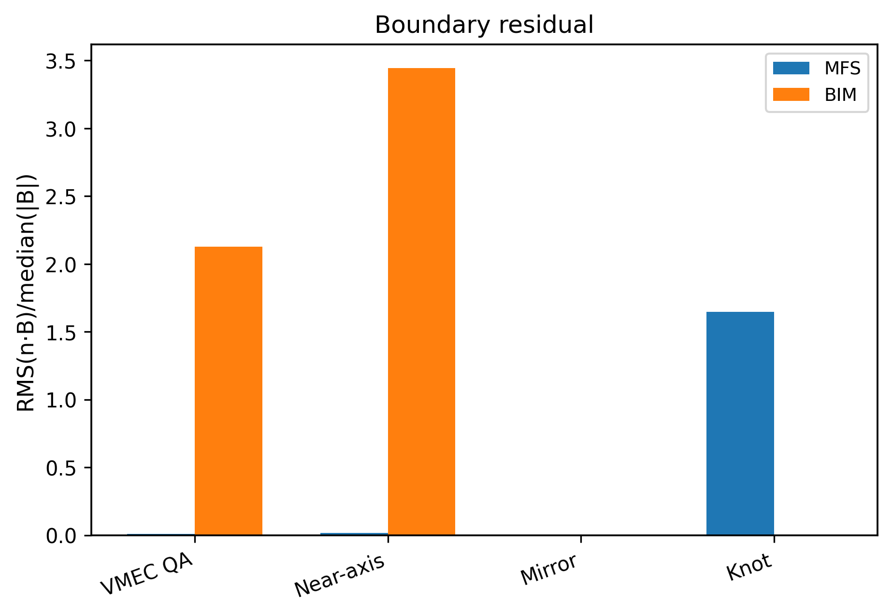

# BIMFx

Vacuum magnetic field solvers for arbitrary 3D boundaries using:

- **MFS**: Method of Fundamental Solutions
- **BIM**: Boundary integral method (single-layer potential)

Given a closed surface point cloud `x_i` and outward unit normals `n_i`, BIMFx solves Laplace’s equation for a magnetostatic potential `φ` such that the vacuum magnetic field

`B = ∇φ`  

satisfies the **perfect-conductor / flux-surface boundary condition**

`n · B = 0` on the boundary.

The intent is to make *vacuum-field solves differentiable in JAX* so the same code can be used inside geometry optimization loops (e.g. quasi-symmetry design).

## Status

BIMFx is under active development. The current public API focuses on:

- Solving for `B(X)` inside a boundary given `(points, normals)`
- Providing both **MFS** and **BIM** implementations behind a simple interface
- Differentiable JAX solvers with implicit differentiation for linear solves
- Barnes-Hut accelerated evaluation for large point sets

Planned functionality (manufactured solutions, optimization utilities, exterior solves) is tracked in the docs roadmap.

## Install

This is a standard Python package (PEP 517/518). For development:

```bash
git clone https://github.com/uwplasma/BIMFx
cd BIMFx
pip install -e .
```

### JAX 64-bit requirement

BIMFx solvers require JAX **64-bit mode** for numerical stability.

Set the environment variable before running Python:

```bash
export JAX_ENABLE_X64=1
```

## Quickstart

Solve from a boundary point cloud stored in CSV files:

```python
import numpy as np
from bimfx import solve_mfs

P = np.loadtxt("boundary.csv", delimiter=",", skiprows=1)         # (N,3)
N = np.loadtxt("boundary_normals.csv", delimiter=",", skiprows=1) # (N,3)
N = N / np.linalg.norm(N, axis=1, keepdims=True)

field = solve_mfs(P, N, toroidal_flux=1.0)
B = field.B(P)  # (N,3)
```

There is also a small runnable example:

```bash
JAX_ENABLE_X64=1 python examples/solve_vacuum_from_csv.py --help
```

## Boundary I/O

BIMFx includes utilities to load boundary point clouds from common sources:

- VMEC `wout*.nc`
- SLAM `.npz`
- SFLM `.npy`
- STL meshes (optional; requires `trimesh`)

See `docs/io.md` and `examples/convert_boundary.py`.
For preprocessing and consistent normal orientation rules, see `docs/preprocessing.md`.
For recipes that cover meshes, point clouds, and VMEC, see `docs/your_geometry.md`.

## Field-Line Tracing

Field-line tracing and Poincare section tools are available in `bimfx.tracing`.
See `docs/tracing.md`.

JAX-based tracing is available for large batches (see `docs/performance.md`).

## Differentiable core (JAX)

JAX-native MFS/BIM solvers are available for differentiable workflows:
`solve_mfs_jax`, `solve_bim_jax`. See `docs/differentiable.md`.
Linear solves use custom VJP (implicit differentiation) for stable gradients.

## Flux-Surface Finding (FCI)

An FCI-inspired anisotropic diffusion solver is available in `bimfx.fci`, along with
high-level workflows for fitting flux surfaces and analyzing Poincare overlays.
See `docs/fci.md`.

## Validation

Validation helpers for boundary residuals and divergence checks are in
`bimfx.validation`. See `docs/validation.md`.
CI compares validation baselines (`baselines/validation_report/summary.csv`) to catch regressions.

### Validation figures (bundled)





## Gallery





## Benchmarks





## Examples and datasets

Example scripts live in `examples/`, with bundled input datasets in `inputs/`.
See `docs/examples.md` and `docs/io.md`.

## CLI and pipeline

```bash
JAX_ENABLE_X64=1 bimfx --input inputs/knot_tube.csv --normals inputs/knot_tube_normals.csv --method mfs --validate \
  --k-nn 24 --lambda-reg 1e-6 --acceleration barnes-hut
```

See `docs/workflow.md` for configuration-based pipelines.

For a paper-ready validation report across all datasets:

```bash
JAX_ENABLE_X64=1 python examples/validation_report.py --outdir outputs/validation_report
```

## Documentation

Documentation lives in `docs/` and is set up for ReadTheDocs.

Build locally:

```bash
pip install -e '.[docs]'
cd docs
make html
```

## Repository layout

- `src/bimfx/`: library code
- `examples/`: runnable scripts
- `inputs/`: small sample boundary datasets
- `docs/`: Sphinx documentation

## License

MIT. See `LICENSE`.
