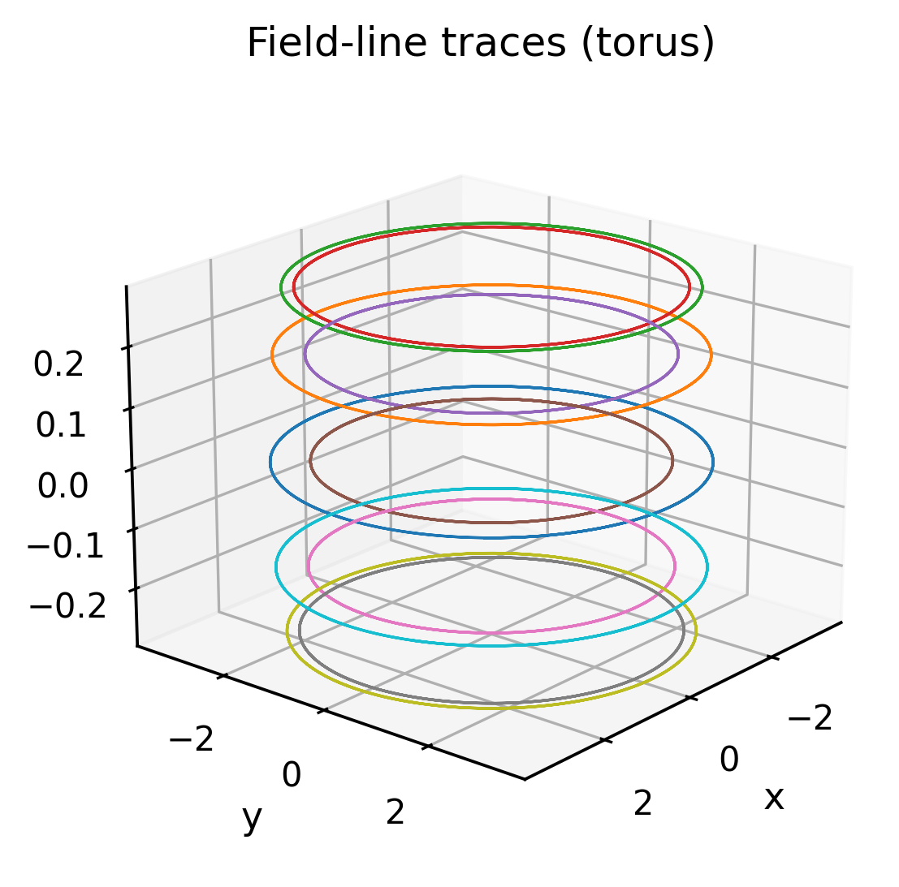

# Gallery

This page collects representative figures generated from BIMFx example scripts.
All images can be reproduced using `examples/generate_gallery_figures.py`.

## Boundary point clouds

## Field-line tracing

## Poincaré section

## BIM vs MFS comparison

